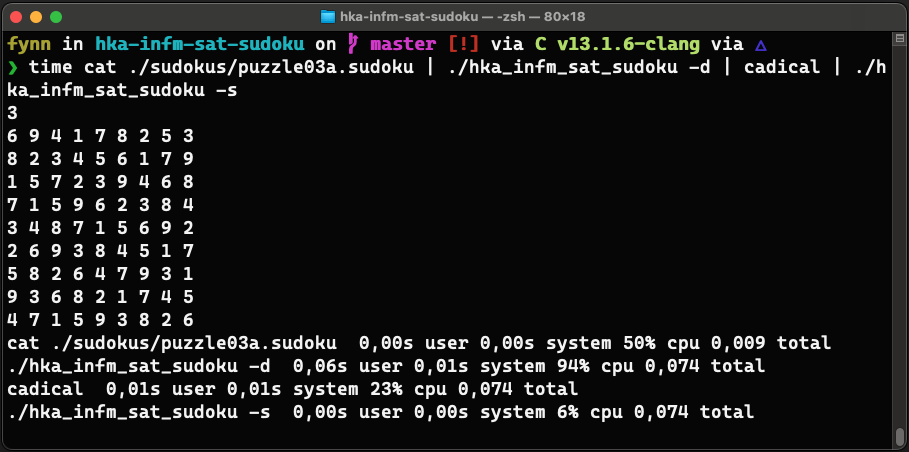

# hka-infm-sat-sudoku
Exercise 2 "Sudoku" for sheet 1 in course "Practical SAT Solving" at Hochschule Karlsruhe

This is a Sudoku solver using SAT solving methods.

## Compile

Compile with `cmake CMakeLists.txt && make`. This will create an executable such as `hka_infm_sat_sudoku`.

## Usage

The application will read [.sudoku files](https://baldur.iti.kit.edu/sat/files/sudokus.zip) from stdin. To execute, run `cat file.sudoku | ./hka_infm_sat_sudoku -d`.
This will print a DIMACS-formatted variable to stdout, which you can either redirect to a file or pipe to a SAT solving tool of your choice (such as [CaDiCaL](https://github.com/arminbiere/cadical)):

`cat file.sudoku | ./hka_infm_sat_sudoku -d > sudoku_sat.col`

`cat file.sudoku | ./hka_infm_sat_sudoku -d | cadical`

The SAT solving tool will output a DIMACS format to stdout again. You can pipe that to the application again to print the soludtion in the .sudoku format.
As a one-liner, use:

`cat file.sudoku | ./hka_infm_sat_sudoku -d | cadical | ./hka_infm_sat_sudoku -s`

## Arguments

There are two program argument options:

| Option                             | Description                                                              |
|------------------------------------|--------------------------------------------------------------------------|
| `-h` or `--help`               | Print a help page to stdout.                                             |
| `-d` or `--generate-dimacs`    | Read a .sudoku file from stdin and print DIMACS format to stdout.        |
| `-s` or `--interpret-solution` | Read solved DIMACS format from stdin and print .sudoku format to stdout. |

## Benchmarking

The code might not be the most efficient. To measure the duration, you can just use the `time` application like this:

`time cat file.sudoku | ./hka_infm_sat_sudoku -d | cadical | ./hka_infm_sat_sudoku -s`

This will output something like this:

If you want to solve sudoku puzzles of high orders (e.g. 8, meaning 64x64 grid), it is better not to use a piped one-liner. I recommend to redirect stdout to a file and reading the file again in the next step:

1. `cat file.sudoku | ./hka_infm_sat_sudoku -d > sudoku_formula.col`

2. `cat sudoku_formula.col | cadical | ./hka_infm_sat_sudoku -d`

## License

&copy; 2022 Fynn Arnold

Licensed under the [EUPL](LICENSE)